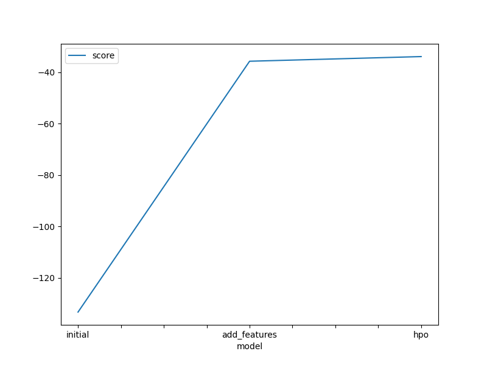
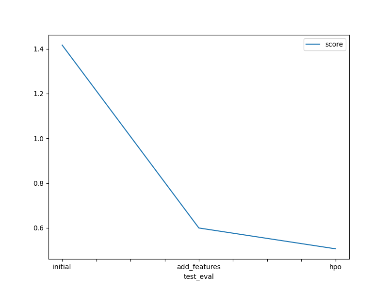

# Report: Predict Bike Sharing Demand with AutoGluon Solution
#### NAME HERE

## Initial Training
### What did you realize when you tried to submit your predictions? What changes were needed to the output of the predictor to submit your results?
I noticed the csv was missing two column headers as it was being loaded from a pd.Series instead of a pd.DataFrame. So I changed the formatting.

### What was the top ranked model that performed?
The WeightedEnsemble_L3 performed best

## Exploratory data analysis and feature creation
### What did the exploratory analysis find and how did you add additional features?
I firstly changed/parsed variable to include categorical variables and datetime into the model.
Then, I considered outliers and missing values. I found none.
Then I looked at correlation analysis with orignal and engineered features.
I found most unique features had weak correlation to the target, but decided to keep them nonetheless.
I only decided to remove temp due to autocorrelation against atemp.

### How much better did your model preform after adding additional features and why do you think that is?
Performance improved dramatically: from 1.416644 Kaggle score to 0.51427 Kaggle score
I believe the most imporant addition is the hour predictor. 
There is a strong correlation pattern between hour and target, by including it the model is able to learn
this pattern and dramatically imporove the predictions.

## Hyper parameter tuning
### How much better did your model preform after trying different hyper parameters?
The improvement after tuning was more gradual: 

### If you were given more time with this dataset, where do you think you would spend more time?
TODO: I would have liked to consider the data as time-series and look for more insights there.
For example consider wider market trends/adoption/seasonality: e.g. christmas week.

### Create a table with the models you ran, the hyperparameters modified, and the kaggle score.
|model|num_stack_levels=0|num_stack_levels=1|num_stack_levels=2|num_stack_levels=3|score|
|--|--|--|--|--|--|
|initial|-|-|-|-|1.41644|
|add_features|-|-|-|-|0.59524|
|hpo|0.50653|0.59319|0.64384|0.66752|0.50653|

### Create a line plot showing the top model score for the three (or more) training runs during the project.

### Create a line plot showing the top kaggle score for the three (or more) prediction submissions during the project.

## Summary
Overall, this exercise was very sueful in exploring how Autogluon allows the fast and effective application of many predictive models to a dataset.
Although it is very simple to use, it is clear that via careful data analysis and hyperparmeter tuning can be employed to maximize model performance with a careful eye on technical trade-offs.
